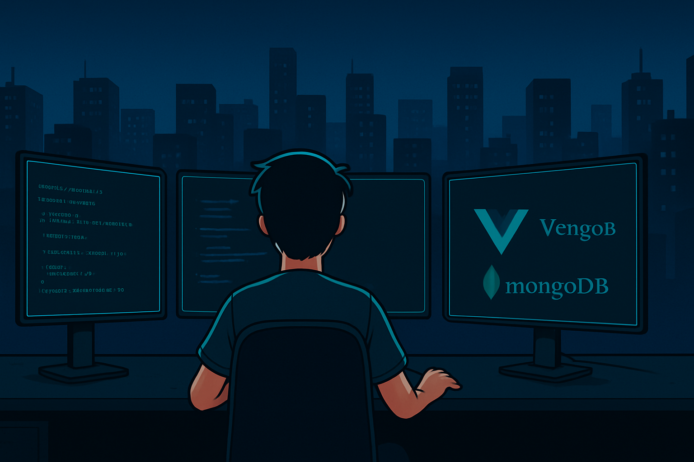

  

<h1 align="center">Hi, I'm James Patrick Sanchez 👋</h1>

  <strong>Backend Software Engineer • Full-Stack Developer • BSIT Student</strong>

  I build scalable backend systems, real-time applications, and production-ready SaaS projects using modern web technologies.

  
  
  

---

# 🚀 About Me

🎓 BS Information Technology Student graduating in **August 2026**

💼 Currently looking for opportunities as a

- Backend Software Engineer
- Software Engineer
- Full-Stack Developer

I enjoy building applications that solve real-world problems with a strong focus on:

- ⚡ High Performance
- 🔒 Security
- 📈 Scalability
- 🧩 Clean Architecture
- 🌐 Real-time Communication

My goal is to write software that is reliable, maintainable, and ready for production.

---

# ⭐ Featured Projects

## 🚀 LiveSales

A modern cloud Point-of-Sale platform designed for restaurants and small businesses.

### Features

- Real-time order tracking using Socket.IO
- Role-based authentication
- Dashboard analytics
- Demo Mode
- JWT Authentication
- Responsive dashboard

**Tech Stack**

NestJS • React • PostgreSQL • Prisma • Socket.IO • TypeScript

> 🔗 Live Demo: *(Add your link)*

> 💻 Repository: *(Add repository link)*

---

## 📈 PulseAPI

A real-time API monitoring platform that tracks uptime, incidents, and service health.

### Features

- Real-time monitoring
- Incident management
- Scheduler
- Live dashboard
- WebSocket updates
- Authentication
- Demo Mode

**Tech Stack**

NestJS • React • PostgreSQL • Prisma • Socket.IO • TypeScript

> 🔗 Live Demo: *(Add your link)*

> 💻 Repository: *(Add repository link)*

---

## 🔗 SnapURL

A secure URL shortener built with modern backend architecture.

### Features

- Short URLs
- QR Code Generation
- Expiration Dates
- Analytics
- JWT Authentication
- Dashboard
- Demo Mode

**Tech Stack**

NestJS • React • PostgreSQL • Prisma • TypeScript

> 🔗 Live Demo: *(Add your link)*

> 💻 Repository: *(Add repository link)*

---

# 🛠 Tech Stack

---

# 📚 Currently Learning

- System Design
- Distributed Systems
- Microservices
- Cloud Deployment
- Docker
- CI/CD
- Performance Optimization
- Testing
- Scalable Backend Architecture

---

# 📊 GitHub Statistics

---

# 🤝 Let's Connect

📧 **Email**

**mrsniper1388@gmail.com**

💼 **LinkedIn**

https://www.linkedin.com/in/james-patrick-sanchez-360552342

🌐 **GitHub**

https://github.com/JamesPatrick30

📸 **Instagram**

https://www.instagram.com/sanchezjamespatrick

💬 **Discord**

https://discord.gg/8r8vcQYg

✈️ **Telegram**

https://t.me/Pattyyy_30

---

### Thanks for visiting my profile! ⭐

If you like my projects, feel free to give them a ⭐ and connect with me.

