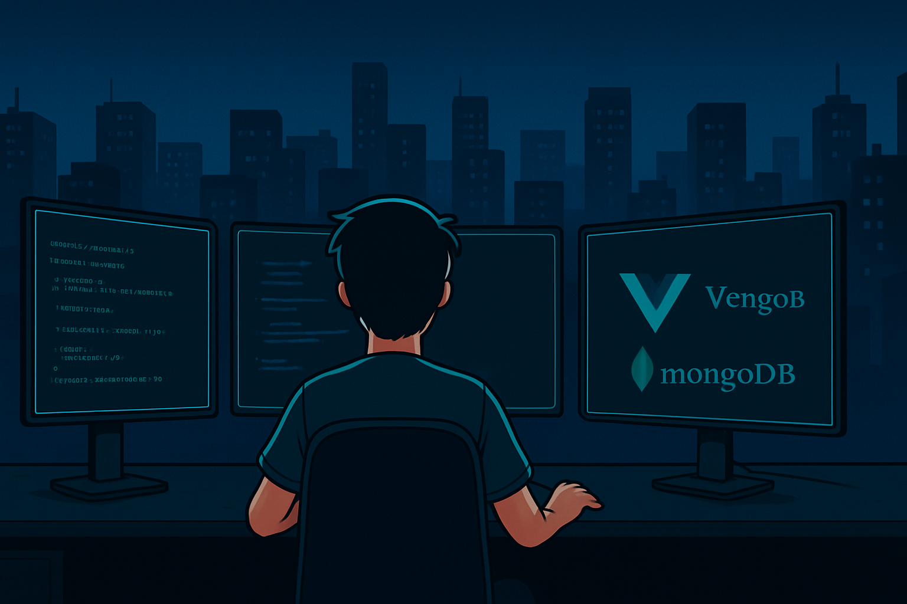

---

## 🌟 About Me

I’m **James Patrick Sanchez**, a passionate software developer and BSIT student at **Don Honorio Ventura State University (DHVSU)**. I specialize in **full-stack development, real-time systems, and performance-oriented backend architectures**.  

- 🚀 Experienced in **Node.js, Vue.js, MongoDB, Socket.IO, Prisma, BullMQ**, and microservice patterns.  
- 👨‍💻 Proficient in **Java, Python (Flask), C++, JavaScript, PostgreSQL**, and more.  
- 🧩 Lead programmer in multiple school projects, hackathons, and competitions.  
- ⚙️ Focused on **WebSockets, real-time multiplayer systems, queue-based processing**, and **UI/UX design**.  
- ✨ I aim for **simplicity, speed, and maintainable code** in all projects.

---

## 🛠️ Languages & Tools

  

---

### 🧰 Tech Stack Overview

**Languages & Frameworks**  

**Databases & ORMs**  

**DevOps, Tools & Real-time**  

**Version Control & Design**  

---

## 📬 Let's Connect

- **Email:** [mrsniper1388@gmail.com](mailto:mrsniper1388@gmail.com)  
- **LinkedIn:** [James Patrick Sanchez](https://www.linkedin.com/in/james-patrick-sanchez-360552342)  

**Social Media**  
  
  
  
